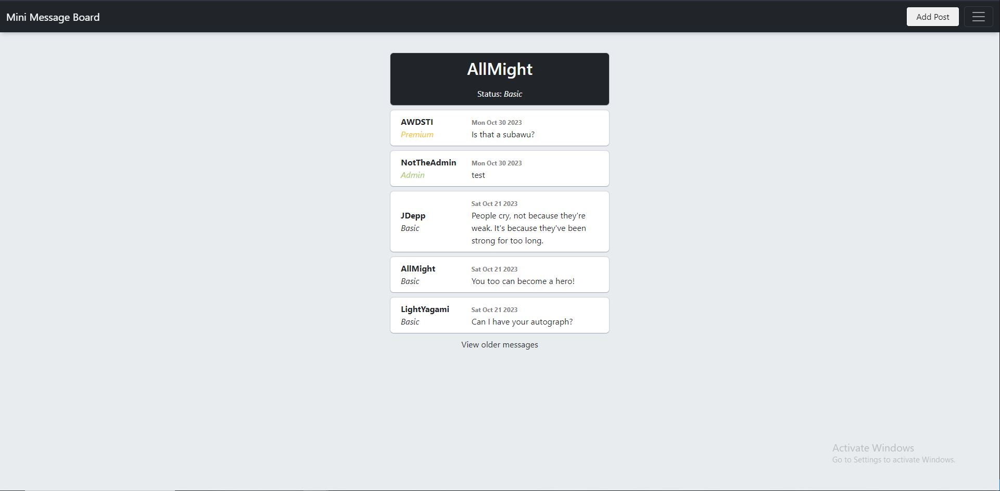
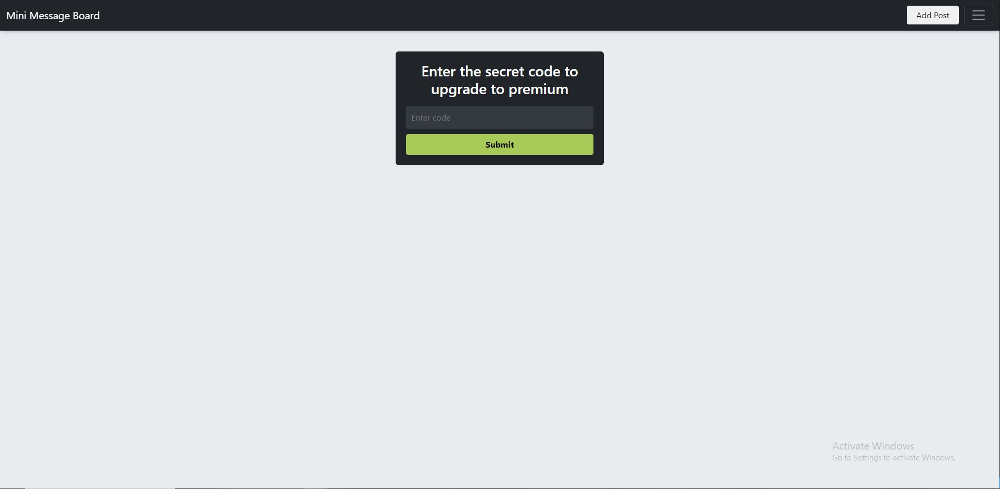
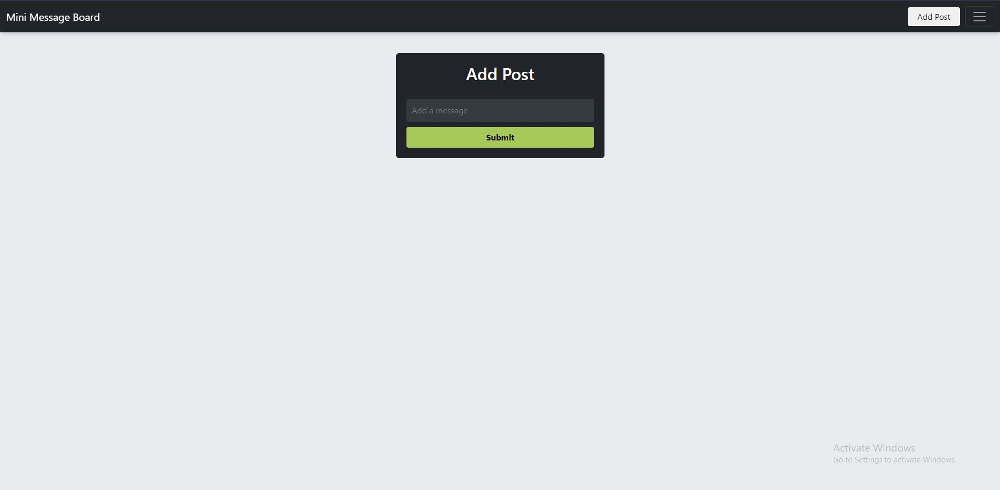

# TheOdinProject - Project: Members Only

This is a solution to the [Project: Members Only](https://www.theodinproject.com/lessons/nodejs-members-only).

 **** Below is the code to upgrade user to premium
SecretCode: iupgraded!


Here are accounts if you do not want to register.
They are also on populatedb.


Admin info:
NotTheAdmin
odinadmin1


User info:
Takumi
odin1234


## Table of contents

- [Overview](#overview)
  - [The challenge](#the-challenge)
  - [Screenshot](#screenshot)
  - [Links](#links)
- [My process](#my-process)
  - [Built with](#built-with)
  - [What I learned](#what-i-learned)
  - [Useful resources](#useful-resources)
- [Author](#author)


## Overview

### The challenge

- Build an exclusive clubhouse where your members can write anonymous posts
- Members can see who the author of a post is
- Users are able to register and login
- Use encryption when verifying sensetive information


### Screenshot






### Links

- Solution URL: [https://github.com/TheLegend760/MembersOnlyMsgBoard-TheOdinProject]
- Live Site URL: [https://membersonly-mvoe.onrender.com]

## My process

### Built with

- Semantic HTML5 markup
- CSS custom properties
- Flexbox
- ExpressJS
- Bootstrap


### What I learned

In this lesson I learned how to use bycrpt to hash the password and verify it. I also learned how to create a token so that the application can verify the user that is logged in.


```js
router.post('/', authMidware, asyncHandler( async (req, res, next) => {
  const userData = req.userData;
  if(userData) {
    return res.redirect('/')
   }

  try {
  const { username, password, verifypw } = req.body;

  // Check if user exist
  const doesUserExist = await User.exists({ username: username});
  // Encrypt password
  const hashedPassword = await bcrypt.hash(password, 10);
  // Create new user
  const newUser = User({
    username,
    password: hashedPassword
  });
  // If user exist add error message 
  if(doesUserExist) {
      res.render('register', { 
      title: 'Register',
      errorMsg: 'Username already exist',
    });
    return;
  };

  // If password and verify password does not match send error message
  if(password !== verifypw) {
    res.render('register', { 
      title: 'Register',
      errorMsg: 'Passwords do not match',
    });
    return;
  };
  // If there are no other errors save user and redirect to home page
  await newUser.save();
  res.redirect('/');

  } catch (error) {
    const err = new Error('Something went wrong');
    err.status = 404;
    return next(err);
  }
}));


  // Create a cookie with the new token
  const token = jwt.sign({ userId: doesUserExist._id}, jwtSecret);
  res.cookie('token', token, { httpOnly: true});

```


### Useful resources

- [Stackoverflow](https://www.stackoverflow.com) - This helped me searched for certain functions
- [Youtube - Net Ninja](https://www.youtube.com/watch?v=-foo92lFIto) - This tutorial from Net Ninja allowed me to build the foundation of the project


## Author
- Email - [kevin760g@gmail.com]


